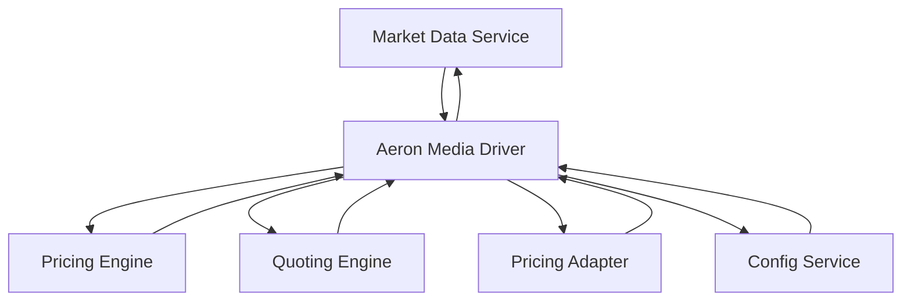
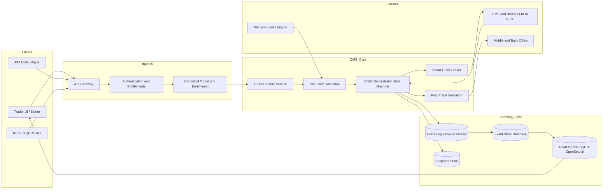

# FX Trading Platform

A modular, real-time FX trading platform built with Java, Spring Boot, and Vaadin.  
It supports tiered pricing, latency smoothing, and customizable risk controls — ideal for simulating and deploying
institutional-grade FX pricing engines.

---

## 🚀 Features

- **Tiered Pricing Engine** – Generate client-specific quotes based on credit limits, inventory, and business rules.
- **Latency Smoothing** – Protect against latency arbitrage by smoothing quote updates.
- **Quote Throttling** – Control the frequency of quote updates to manage system load.
- **Vaadin UI** – Interactive frontend for monitoring and adjusting pricing parameters.
- **Aeron/SBE Backend** – Robust backend services for market data ingestion and pricing, execution at high speeds/low
  latencies.
- **Single Threaded Processes**
- **Extensible Architecture** – Modular design for integrating OMS, analytics, and execution.
- **TODO** - Stress Tests, Benchmarks, Metrics, Failover

---

## 🧱 Architecture

The platform is structured into the following Maven modules:

- `market-data` – Handles market data feed ingestion and preprocessing.
- `pricing-engine` – Core logic for quote construction and tiered pricing.
- `quoting-engine` – Layer between pricing and distribution, to optimize distribution streams fan-out.
- `config-service` – Delivers config changes directly to all processes via aeron config messages, Vaadin-based frontend
  for managing configs in live env.
- `commons` – Shared utilities, config models, and data objects.
- `aeron-media-driver` – Independent media driver with arhciving enabled to store and retrieve the runtime
  configurations.

---

Blotter - Work In Progress


## 🛠️ Getting Started

### Prerequisites

- Java 21 or later
- Maven 3.6+

### Build & Run

```bash
# Clone the repo
git clone https://github.com/nitindandriyal/efx-trading-platform.git
cd efx-trading-platform

# Build the entire project
mvn clean install

# Run the UI module (or root Spring Boot launcher if defined)
cd market-data
mvn spring-boot:run
```


## Architecture Diagram

Below is the architecture diagram of the FX Trading Platform, illustrating the interaction between the processes.



OMS



