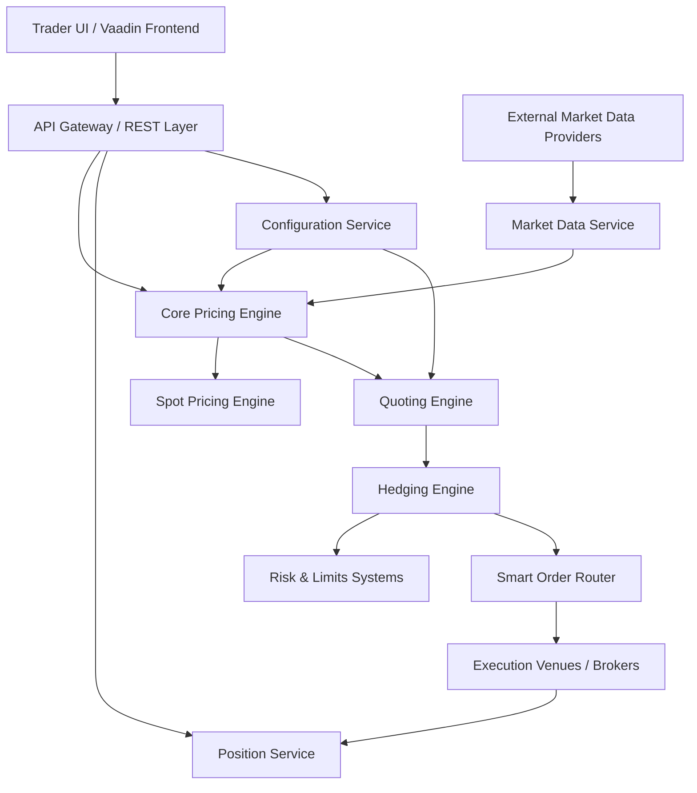
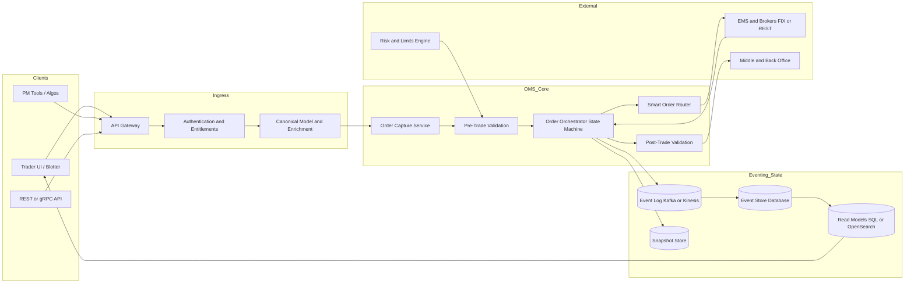

# FX Trading Platform

A modular, real-time FX trading platform built with Java, Spring Boot, and Vaadin.  
It supports tiered pricing, latency smoothing, and customizable risk controls — ideal for simulating and deploying
institutional-grade FX pricing engines.

---

## 🚀 Features

- **Tiered Pricing Engine** – Generate client-specific quotes based on credit limits, inventory, and business rules.
- **Latency Smoothing** – Protect against latency arbitrage by smoothing quote updates.
- **Quote Throttling** – Control the frequency of quote updates to manage system load.
- **Vaadin UI** – Interactive frontend for monitoring and adjusting pricing parameters.
- **Aeron/SBE Backend** – Robust backend services for market data ingestion and pricing, execution at high speeds/low
  latencies.
- **Single Threaded Processes**
- **Extensible Architecture** – Modular design for integrating OMS, analytics, and execution.
- **TODO** - Stress Tests, Benchmarks, Metrics, Failover

---

## 🧱 Architecture

## Components Explained

### 1. Trader UI (Vaadin Frontend)

The web-based user interface built using Vaadin.

**Responsibilities:**
- Live FX pricing display  
- Trade execution capabilities  
- Position monitoring  
- Configuration management views  

Acts as the primary interaction layer for the platform.

---

### 2. API Gateway / REST Layer

Central entry point for all client interactions.

**Responsibilities:**
- Exposes REST endpoints  
- Routes requests to internal services  
- Handles authentication and request validation  
- Orchestrates trade and pricing workflows  

This layer decouples the frontend from core trading engines.

---

### 3. Configuration Service

Manages dynamic system configuration across services.

**Responsibilities:**
- Centralized configuration management  
- Runtime configuration updates  
- Distribution of config changes to dependent services  

Ensures consistency and operational flexibility.

---

### 4. Market Data Service

Ingests and processes external FX market data feeds.

**Responsibilities:**
- Connects to liquidity providers  
- Normalizes incoming price feeds  
- Publishes structured market data internally  

Provides real-time input to pricing engines.

---

### 5. Core Pricing Engine

Calculates tradable FX prices.

**Responsibilities:**
- Applies spreads and markups  
- Considers inventory and risk exposure  
- Generates tiered client pricing  
- Reacts to live market data updates  

This is the heart of price generation.

---

### 6. Spot Pricing Engine

Handles spot FX-specific pricing logic.

**Responsibilities:**
- Spot rate calculations  
- Specialized pricing adjustments  
- Integration with core pricing models  

Separates asset-specific logic from the core engine.

---

### 7. Quoting Engine

Distributes generated prices to clients and downstream systems.

**Responsibilities:**
- Formats quotes for consumers  
- Controls quote throttling  
- Manages client-specific quote streams  

Optimizes price dissemination.

---

### 8. Position Service

Tracks trade lifecycle and exposure.

**Responsibilities:**
- Maintains open positions  
- Updates exposure after executions  
- Provides position reporting  

Critical for risk visibility and PnL tracking.

---

### 9. Hedging Engine

Offsets risk generated by client trades.

**Responsibilities:**
- Monitors net exposure  
- Determines hedge requirements  
- Triggers offsetting trades  

Protects the platform from unwanted market risk.

---

### 10. Smart Order Router (SOR)

Routes hedge or client orders to optimal execution venues.

**Responsibilities:**
- Selects best liquidity venue  
- Applies routing rules  
- Integrates with brokers or ECNs  

Ensures efficient trade execution.

---

### 11. External Market Data Providers

Third-party liquidity sources providing FX pricing.

**Examples:**
- Banks  
- ECNs  
- Aggregated liquidity feeds  

Supply real-time market inputs.

---

### 12. Risk & Limits Systems

Pre-trade and post-trade risk controls.

**Responsibilities:**
- Credit checks  
- Limit enforcement  
- Trade validation  

Ensures compliance with risk policies.

---

### 13. Execution Venues / Brokers

External systems where trades are executed.

**Examples:**
- Prime brokers  
- Liquidity venues  
- Trading counterparties  

Finalize trade lifecycle outside the platform.


```mermaid
flowchart TB

    %% Clients
    UI[Trader UI / Vaadin Frontend]

    %% API Layer
    APIGW[API Gateway / REST Layer]
    CONFIG[Configuration Service]

    %% Core Services
    MD[Market Data Service]
    PRICING[Core Pricing Engine]
    SPOT[Spot Pricing Engine]
    QUOTE[Quoting Engine]
    POSITION[Position Service]

    %% Trading Logic
    HEDGE[Hedging Engine]
    SOR[Smart Order Router]

    %% External Systems
    FEEDS[External Market Data Providers]
    RISK[Risk & Limits Systems]
    EXEC[Execution Venues / Brokers]

    %% Flows
    UI --> APIGW
    APIGW --> PRICING
    APIGW --> POSITION
    APIGW --> CONFIG

    FEEDS --> MD
    MD --> PRICING
    PRICING --> SPOT
    PRICING --> QUOTE

    QUOTE --> HEDGE
    HEDGE --> RISK
    HEDGE --> SOR

    SOR --> EXEC
    EXEC --> POSITION

    CONFIG --> PRICING
    CONFIG --> QUOTE

    %% Annotations
    classDef external fill:#f9f,stroke:#333,stroke-width:2px
```


Blotter - Work In Progress


## 🛠️ Getting Started

### Prerequisites

- Java 21 or later
- Maven 3.6+

### Build & Run

```bash
# Clone the repo
git clone https://github.com/nitindandriyal/efx-trading-platform.git
cd efx-trading-platform

# Build the entire project
mvn clean install

# Run the UI module (or root Spring Boot launcher if defined)
cd market-data
mvn spring-boot:run
```


## Architecture Diagram

Below is the architecture diagram of the FX Trading Platform, illustrating the interaction between the processes.

OMS


```mermaid

flowchart LR

  subgraph Clients
    UI[Trader UI / Blotter]
    PM[PM Tools / Algos]
    API[REST or gRPC API]
  end

  subgraph Ingress
    GW[API Gateway]
    AUTH[Authentication and Entitlements]
    NORM[Canonical Model and Enrichment]
  end

  subgraph OMS_Core
    OC[Order Capture Service]
    PRE[Pre-Trade Validation]
    ORCH[Order Orchestrator State Machine]
    ROUTE[Smart Order Router]
    POST[Post-Trade Validation]
  end

  subgraph Eventing_State
    LOG[(Event Log Kafka or Kinesis)]
    ES[(Event Store Database)]
    SNAP[(Snapshot Store)]
    RM[(Read Models SQL or OpenSearch)]
  end

  subgraph External
    EMS[EMS and Brokers FIX or REST]
    RISK[Risk and Limits Engine]
    BO[Middle and Back Office]
  end

  UI --> GW
  PM --> GW
  API --> GW

  GW --> AUTH --> NORM --> OC --> PRE --> ORCH --> ROUTE --> EMS
  EMS --> ORCH
  ORCH --> POST --> BO

  ORCH --> LOG --> ES
  ES --> RM
  ORCH --> SNAP
  RM --> UI

  RISK --> PRE

```

